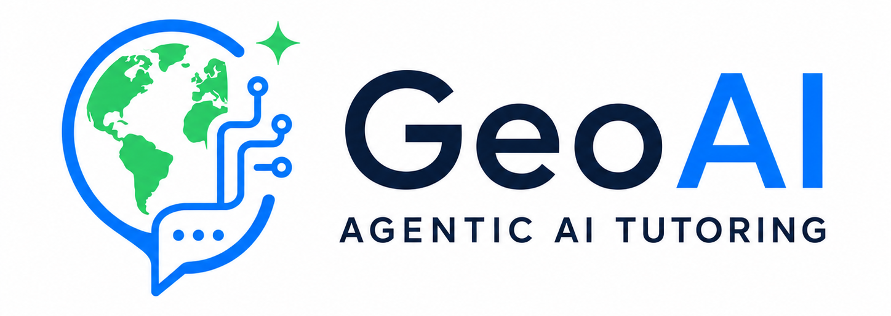

# GeoAITutoring



**GeoAITutoring** is a starter kit for a Telegram-based Socratic AI tutor that helps students learn geography and natural-disaster concepts through guided questioning instead of direct answer dumping.

The first learning domain is **natural disasters**: earthquakes, volcanoes, floods, tsunamis, landslides, climate hazards, mitigation, risk, vulnerability, exposure, and disaster case studies.

## About

GeoAITutoring is an AI-powered adaptive learning system for geography education. It uses Telegram as the student interface, n8n as the automation layer, Supabase for persistent learning memory, and retrieval-augmented generation to ground tutoring responses in disaster-geography learning materials.

Instead of acting like a normal chatbot, the system guides students with Socratic questions, hints, misconception repair, short explanations, and adaptive assessments. The goal is to help students understand why disasters happen, how risk can be reduced, and how geographic concepts connect to real-world disaster events.

## Creators

- Syamsunardi
- Abdul Mannan
- Alfyananda Kurnia Putra
- Soraya Norma Mustika
- Abid Febriansyah
- Diky Al-Khalidy

## Why This Exists

Most AI chatbots answer a student's question immediately. This project is designed to behave more like a careful tutor:

- asks one guiding question at a time
- gives hints before explanations
- detects misconceptions
- adapts difficulty from student performance
- tracks concept mastery over time
- uses curriculum-based retrieval for factual grounding

## Architecture

```text
Telegram Student
  -> Telegram Bot
  -> n8n Tutor Workflow
  -> Supabase Postgres memory/profile/mastery
  -> Supabase Vector or RAGFlow knowledge base
  -> Socratic Tutor LLM
  -> Scoring + mastery update
  -> Telegram Reply
```

Read the full design in [`docs/architecture.md`](docs/architecture.md).

## Features

- Telegram-first student interface
- n8n workflow blueprints for a RAG-enabled adaptive tutor, a simple agent canvas, and a fuller analytics workflow
- Supabase schema for profiles, chat memory, mastery, misconceptions, assessments, and RAG chunks
- Socratic tutor prompt template
- scoring evaluator prompt and mastery update formula
- starter geography disaster concept map
- optional vector retrieval add-on
- setup docs for moving from MVP to production

## Recommended MVP Stack

| Layer | Tool |
| --- | --- |
| Student UI | Telegram Bot |
| Workflow orchestration | n8n |
| Database | Supabase Postgres |
| Chat memory | Supabase tables |
| Vector search | Supabase Vector/pgvector |
| Complex document ingestion | Optional RAGFlow |
| LLM provider | OpenAI, Gemini, Anthropic, or compatible API |

## Tech Stack

| Category | Technology | Purpose |
| --- | --- | --- |
| Chat interface | Telegram Bot API | Student-facing tutor chat |
| Automation | n8n | Workflow orchestration, routing, scoring, and integrations |
| Database | Supabase Postgres | Student profiles, sessions, chat memory, mastery, and scoring history |
| Vector search | Supabase Vector / pgvector | Retrieval for curriculum-based geography content |
| RAG setup | Supabase Vector / pgvector lesson chunks | Lesson-grounded Socratic tutoring with `lesson_chunks` |
| RAG ingestion | RAGFlow, optional | Parsing complex PDFs, diagrams, scanned documents, and case-study materials |
| AI models | OpenAI | Socratic tutor replies, scoring, retrieval query rewriting |
| Prompts | Markdown prompt templates | Tutor behavior, scoring rubric, and retrieval query generation |
| Workflow assets | n8n JSON workflows + Code nodes | Importable Telegram tutoring automation |
| Deployment | n8n Cloud or self-hosted, Supabase Cloud | MVP hosting and managed persistence |
| Analytics | Supabase SQL, Metabase, or dashboard app | Teacher/admin mastery and progress tracking |

## Project Structure

```text
.
|-- docs/
|   |-- architecture.md
|   |-- roadmap.md
|   `-- setup.md
|-- n8n/
|   |-- code/
|   |-- workflows/
|   `-- rag-query-addon.md
|-- prompts/
|-- rag/
|-- supabase/
|-- .env.example
`-- README.md
```

## Quick Start

1. Create a Telegram bot with `@BotFather`.
2. Create a Supabase project.
3. Run [`supabase/rag_setup.sql`](supabase/rag_setup.sql) in the Supabase SQL editor.
4. Skip [`supabase/schema.sql`](supabase/schema.sql) for the v3 workflow unless you are intentionally using the older full analytics workflow in a separate database/schema.
5. Import [`n8n/workflows/geoai-enhanced-socratic-tutor-v3.workflow.json`](n8n/workflows/geoai-enhanced-socratic-tutor-v3.workflow.json) into n8n.
6. Configure n8n credentials:
   - Telegram Bot API
   - Supabase Postgres
   - OpenAI chat model credential
   - OpenAI HTTP Header Auth credential for embeddings
7. Test the bot in Telegram:

```text
Why do earthquakes happen?
```

Detailed setup steps are in [`docs/setup.md`](docs/setup.md).

### Recommended Workflow

Use [`n8n/workflows/geoai-enhanced-socratic-tutor-v3.workflow.json`](n8n/workflows/geoai-enhanced-socratic-tutor-v3.workflow.json) for the best MVP experience.

It includes:

- automatic `student_profiles` table creation on first contact
- command handling for `/start`, `/help`, `/progress`, `/topic`, `/reset`, and `/hint`
- persisted attempt count, mastery score, current topic, and misconceptions
- intent classification for greetings, questions, answer attempts, clarification, and bypass attempts
- Indonesian/English language detection
- adaptive response modes from Socratic question to hint, concept explanation, partial answer, and full answer
- RAG retrieval from `lesson_chunks` using OpenAI embeddings and pgvector similarity search
- misconception detection for common Earth Science and disaster-geography errors
- spaced repetition cues based on previous misconceptions
- topic progression and completed-topic tracking
- guardrails that block premature answer reveals
- state updates after every Telegram exchange

### Simpler Agent-Style Workflow

If you prefer a cleaner n8n canvas that looks like a native AI Agent workflow, import [`n8n/workflows/geoai-agent-style.workflow.json`](n8n/workflows/geoai-agent-style.workflow.json) instead.

This version uses:

```text
Telegram Trigger -> GeoAI Socratic Agent -> Send Telegram Message
                      |-> GPT 5 Mini
                      `-> Postgres Chat Memory
```

Use `geoai-enhanced-socratic-tutor-v2.workflow.json` when you want the adaptive tutor without RAG. Use the fuller `telegram-socratic-tutor.workflow.json` when you want explicit Supabase mastery tables, scoring history, and structured learning analytics.

## Penjelasan Node Workflow v3

Bagian ini menjelaskan fungsi setiap node pada workflow [`geoai-enhanced-socratic-tutor-v3.workflow.json`](n8n/workflows/geoai-enhanced-socratic-tutor-v3.workflow.json).

| Node | Fungsi |
| --- | --- |
| Telegram Trigger | Menerima pesan masuk dari siswa melalui bot Telegram dan memulai workflow. |
| Load Student State | Mengambil atau membuat profil siswa di Postgres berdasarkan Telegram user ID, termasuk attempt count, mastery score, topik aktif, misconception, dan completed topics. |
| Prepare Context | Menyatukan data Telegram dan database menjadi konteks belajar yang rapi. Node ini mendeteksi intent, command, bahasa, request hint, bypass attempt, misconception, difficulty level, dan spaced repetition cue. |
| Is Command? | Memisahkan pesan command seperti `/start`, `/help`, `/progress`, `/topic`, atau `/reset` dari pesan belajar biasa. |
| Command DB Update | Memperbarui state database untuk command tertentu, terutama reset attempt count saat siswa menggunakan `/reset`. |
| Send Command Response | Mengirim balasan langsung untuk command Telegram tanpa memanggil AI Agent. |
| Get Query Embedding | Mengubah pertanyaan siswa menjadi embedding menggunakan OpenAI agar sistem bisa mencari materi berdasarkan makna, bukan hanya kata yang sama persis. |
| Format Embedding | Mengubah array embedding dari OpenAI menjadi format string pgvector yang bisa digunakan oleh PostgreSQL. |
| Search Lesson Chunks | Mencari potongan materi paling relevan di tabel `lesson_chunks` menggunakan similarity search berbasis pgvector. |
| Format RAG Context | Merapikan hasil pencarian RAG menjadi konteks pembelajaran yang dapat dibaca oleh AI Agent. |
| Orchestrator Agent | AI tutor utama yang membuat respons Socratic berdasarkan pesan siswa, profil belajar, attempt count, mastery score, misconception, difficulty level, bahasa, dan konteks RAG. |
| GPT-4o Mini | Model bahasa yang digunakan oleh Orchestrator Agent untuk menghasilkan respons tutor. |
| Postgres Chat Memory1 | Menyimpan memori percakapan berdasarkan Telegram user ID agar tutor memahami konteks percakapan sebelumnya. |
| Guardrail Gate | Memeriksa apakah respons AI terlalu cepat membocorkan jawaban. Node ini juga mengatur attempt count, mastery score, topic progression, completed topics, dan pencatatan misconception baru. |
| Update Student State | Menyimpan perkembangan terbaru siswa ke Postgres setelah setiap interaksi. |
| Send a text message | Mengirim `finalResponse` dari Guardrail Gate ke Telegram sebagai balasan akhir untuk siswa. |

## Important Tutor Rule

The LLM should not freely decide when to reveal the final answer. n8n computes an `allowed_action`, and the tutor prompt must obey it.

Example policy:

```text
Low mastery -> ask a guiding question
Student stuck -> give a hint
Multiple failed attempts -> give a micro-explanation
Misconception detected -> repair the misconception
High mastery -> move to assessment
```

## RAG Notes

The recommended v3 workflow uses retrieval. To prepare the RAG tables:

1. Run [`supabase/rag_setup.sql`](supabase/rag_setup.sql).
2. Prepare learning chunks using [`rag/knowledge-base-guide.md`](rag/knowledge-base-guide.md).
3. Generate embeddings for `lesson_chunks.embedding`.
4. Import and configure [`n8n/workflows/geoai-enhanced-socratic-tutor-v3.workflow.json`](n8n/workflows/geoai-enhanced-socratic-tutor-v3.workflow.json).

Starter chunks are included without embeddings, so they will not appear in vector search until embeddings are generated. The older `supabase/schema.sql` and `rag/sample-curriculum-chunks.sql` files remain available for the fuller analytics workflow that uses `knowledge_chunks`, but they should not be mixed into the same database table namespace as the v3 lightweight `student_profiles` setup without adjustment.

## Roadmap

- **MVP - Completed Proof of Concept:** Telegram tutor, Supabase memory, Socratic prompt, adaptive attempt tracking, misconception guardrails, and basic scoring are implemented as a working proof of concept.
- **V1 - Learning Intelligence Research:** automatic embeddings, a structured misconception taxonomy, an assessment question bank, and a teacher dashboard will be explored to measure learning progress more rigorously.
- **V2 - Advanced RAG and Personalization Research:** RAGFlow ingestion, reranking, bilingual tutoring, and spaced repetition will be investigated to improve retrieval quality, language accessibility, and long-term retention.
- **Production - Deployment and Safety Research:** evaluation sets, rate limits, privacy review, observability, and backups will be developed to prepare the system for reliable classroom or institutional use.

See [`docs/roadmap.md`](docs/roadmap.md) for the fuller plan.

## Security

Never commit real credentials. Use `.env.example` as a template and store actual API keys inside n8n credentials or your deployment secret manager.
